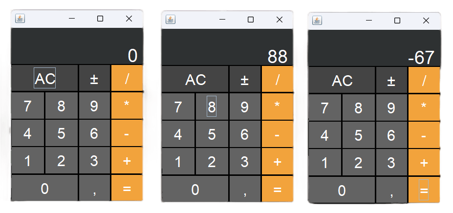

# PROJETO - Calculadora simples em Java

- Projeto de uma Calculadora simples para fins de estudo.
- Desenvolvido utilizando Java em IDE Eclipse para estudar o Swing
- Segue abaixo screenshots do projeto:

 
